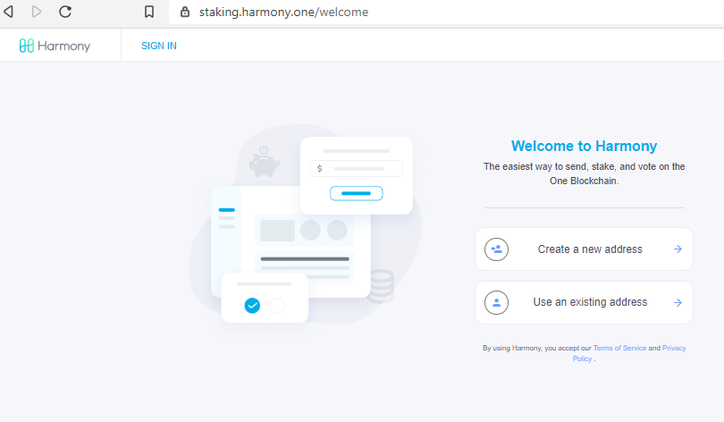
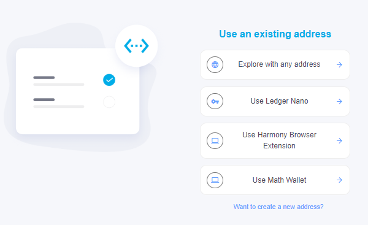

# Staking Dashboard

You can go to [Harmony Staking Dashboard](https://staking.harmony.one/welcome) to stake your tokens. 你可以在[Harmony Staking Dashboard](https://staking.harmony.one/welcome) 上委托手中的代币。

Staking Dashbaord is an easy way to delegate, undelegate, claim rewards and manage your delegations. Currently, staking transaction is supported on Ledger, Harmony Browser Extension and Math Wallet, you can log in or create a new address via those three wallets.

通过使用Staking Dashboard（[_staking.harmony.one_](https://staking.harmony.one/)），任何一位ONE持有者都可以将其代币委托给验证者，取消委托，收集奖励，管理你的抵押代币。 目前为止，Ledger，Harmony插件钱包和麦子钱包支持委托交易。







