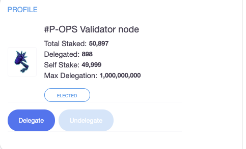

# Staking Transactions 使用Staking Dashboard质押


Note: staking dashboard only process transactions on shard 0.


Check the validators page to see list of validators. Click on desired validator logo to check validator details. 在Validator页面上检查验证者的信息。 单击验证者徽标以检查验证者详细信息。

Click on the "Delegate" button to delegate to this validator.单击“Delegate质押”按钮进行委托。

Enter the desired delegation amount or scroll the percentage slider in the pop-up Delegate window. Delegation must be at least 1000 ONE. Click on "Next" and confirm the signature request. 输入质押金额，或在弹出的“Delegate委托”窗口中滚动百分比滑块。质押金额至少为1000 ONE。单击“下一步”并确认签名请求

不同的钱包使用不同的方式来确认签名请求。 请查看“[钱包](https://app.gitbook.com/@harmony-one/s/harmony-cn-1/~/drafts/-M7FC0IYptiuCGwSVZ8v/wallets)”部分以了解详细信息。

Once transaction is signed, Delegate window will pop-up on the staking dashboard and display the transaction status. 交易签名后，Staking Dashboard将自动弹出“委托”窗口并显示交易状态。Dashboard将自动弹出“委托”窗口并显示交易状态。:

