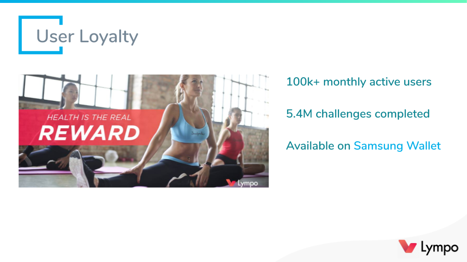
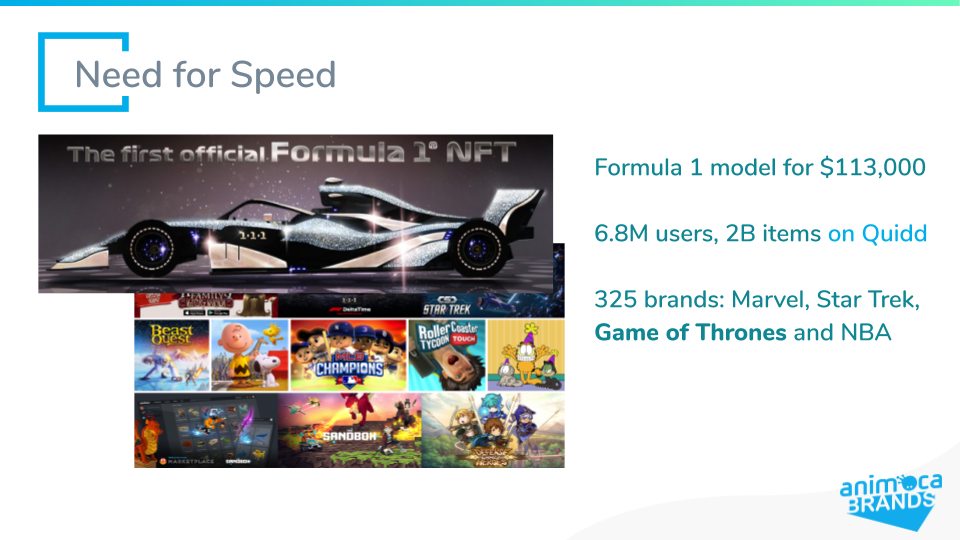
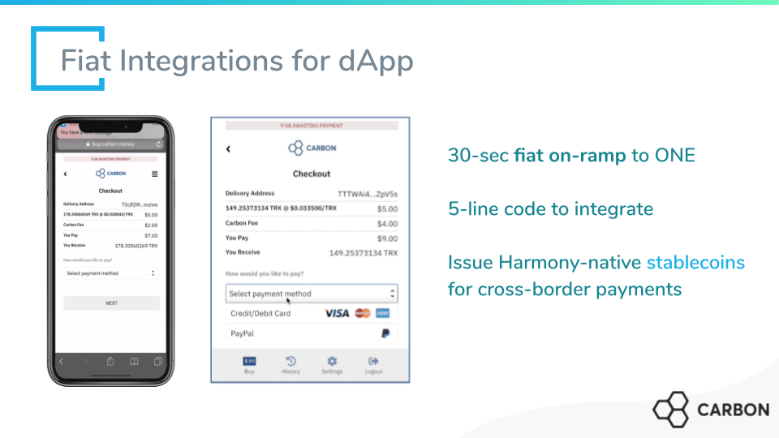

# Case Studie案例分析

Our official partner _Lympo_ incentivizes healthy lifestyle and corporate fitness with reward tokens. They are fully integrated with **Samsung Wallet**; they have hundred thousands of users and millions of exercise challenges completed.

There are 140M profiles for mobile fitness alone. Lympo’s _reward tokens_ will be **exclusively** built on Harmony and our _data-sharing marketplace_.

对于用户，我们不仅关注产品和应用，更关注用户粘性。

我们的官方合作伙伴Lympo使用奖励代币来激励健康的生活方式和企业健身。与三星钱包完全融合；他们已经获得了成千上万的用户和数百万的锻炼任务。

仅移动健身就有1.4亿份资料。Lympo的奖励代币将专门建立在Harmony链上和Harmony的数据共享市场上。

We also announced Harmony’s **$8M joint acquisition** with Animoca of _Quidd_.

Collectibles and digital assets are the best way to jumpstart _bringing values_ to Harmony network. There are millions of fans and creativity in each community such as Marvel and **Game of Thrones**.

Quidd is a marketplace for collectibles. It has **6.8 millions of users** and 2 billions of licensed items. Quidd has already achieved $10M user purchases and averaged 6 transactions/sec.

我们还宣布Harmony与Animoca以800万美元联合收购Quidd。

收藏品和数字资产是为Harmony网络带来价值的最佳方式。每个社区都有数百万的粉丝和创意，比如漫威和《权力的游戏》。

Quidd是一个数字收藏品市场。它拥有680万用户和20亿授权商品。Quidd用户交易金额已经到达了1000万美元，平均每秒6笔交易。

To enable easy migration and quick adoption, we are excited to work with _Carbon_ as our official partner for **fiat integration**.

With Carbon, Harmony dApps can enable any purchases in _ONE tokens_ using **Apple Pay** and credit cards in a few lines of code. The user experience is a _flawless_ and _painless_ fiat on-ramp that can easily be done under a minute.

_Stablecoins_ are cornerstone to any financial applications on crypto. Carbon is helping issue a **FDIC-insured stablecoin** _native_ on Harmony.

Our goal is to decentralize world’s _financial infrastructures_. We’re experimenting with **cross-border payments** and **undercollateralized lending** with alternative credit data.

为了方便迁移和快速大规模应用，我们很高兴地宣布Carbon将成为我们法币入口的官方合作伙伴。

有了Carbon, Harmony上的dApps只需几行代码，就可以使用Apple Pay和信用卡兑换One代币实现任何购买。当法币通道在一分钟之内能够集合完成，用户体验是完美和顺畅的。

稳定币是数字货币金融应用的基石。Carbon正在Harmony上发行一款由联邦存款保险公司\(FDIC\)承保的原生稳定币。

我们的目标是打造去中心化的世界金融基础设施。我们正在试验利用另类信贷数据做跨境支付和无需抵押的贷款。

**The future of privacy** is already here but _unevenly distributed_.

A fellow project, _Findora_, invents the memorable term **auditable privacy** _\*\*\_for everyone to understand \_data sovereignty_ in terms of consumer’s rights vs business uses.

One example is a short _computer proof_ that does not reveal your account books but guarantees **your solvency** to repay loans.

Another example is a single private key with _multiple public keys_ that unlock **different capacities** such as audits and authorization.

Like other sufficiently advanced technologies, these primitives feel **like magic** but are already being demonstrated in practice.

Like Moore’s Law for transistor density, the **algorithmic complexities** and prototype speeds of these privacy technologies are improving by the month.

The _market timing_ fits perfectly for Harmony’s approach of engineering for production.

隐私的未来已经到来，但分布不均。

另一个项目Findora发明了一个令人难忘的术语，可审计隐私 — — 让每个人都可以从消费者权利与商业用途之间的关系来理解数据主权。

举个例子，一个简短的计算机证明，不会显示你的账簿但能够保证你偿还贷款的能力。

另一个例子，一个私钥配备了多个公钥，公钥用于解锁不同的功能，如审计和授权。

与其他高明的技术一样，这些基本的技术虽然感觉起来很神奇，但是已经在实践中证明了可靠性。

就像晶体管密度的摩尔定律一样，这些隐私技术的算法复杂性和原型迭代速度在逐月提高。

Harmony的产品化的工程方法是符合时宜的。

