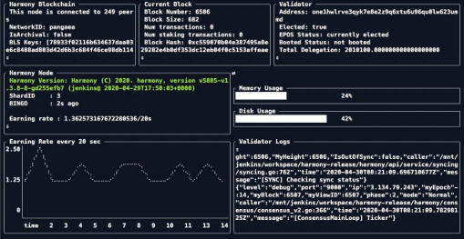

# AutoNode无缝启动


AutoNode is **not optimized for mainnet** yet. This notification will be removed when AutoNode is mainnet compatible.   
****  
**Use "**[**First Time Setup**](first-time-setup/)**" to spin up your validator node!** 


## **Installing AutoNode** 安装AutoNode

### **Step 1:** Spin up your instance on [AWS](cloud-guides/aws.md) or [other providers](https://docs.harmony.one/home/validators/first-time-setup/cloud-guides). 步骤1：在AWS或其他提供商上启动您的实例。

> It is recommended to go with Ubuntu or Amazon Linux as your operating system. 建议将Ubuntu或Amazon Linux用作操作系统。

### **Step 2:** SSH into the machine. 步骤2：通过SSH接入计算机。


AutoNode **DOES NOT** run with root, thus you need to login with a user that is not root.

**Most cloud providers \(like AWS\) give you such an account as the default login.** However, if you don't have a user that is not root, follow the procedures below to create one, otherwise you can just skip this part and go to Step 3.

AutoNode不能以root用户身份运行，因此您需要以非root用户身份登录。 大多数云提供商（例如AWS）都会为您提供一个帐户作为默认登录名。但是，如果您没有非root用户，请按照以下过程创建一个，否则，您可以跳过此部分并转到步骤3。


You can choose any username you want. It will ask for a password and a password confirmation. We will also add this user to the sudo group. Please keep track of this password for future use! 您可以选择任何所需的用户名。它将要求输入密码和密码确认。我们还将这个用户添加到sudo组中。请保留这个密码以备将来使用！

```text
sudo useradd -m <your username>
sudo passwd <your username>
sudo adduser <your username> sudo
```

Now login with the new username you just created. 现在使用刚创建的新用户名登录。

```text
su - <your username>
```


If you wish to automatically reset your node during hard resets \(the `--auto-reset` option in step 7\) your user \(`<your username>`\) must have sudo access without a passphrase. Follow instructions [here](https://www.cyberciti.biz/faq/linux-unix-running-sudo-command-without-a-password/) to set that up.

If you don't want to do that, you can still run AutoNode! Only thing is that on hard resets, you have to do is step 6 and 7 to restart your node.

如果您希望在硬重置（步骤7中的--auto-reset选项）期间自动重置节点，则您的用户（&lt;您的用户名&gt;）必须具有sudo访问权限且无密码。请按照此处的说明进行设置。 如果您不想这样做，仍然可以运行AutoNode！唯一的事情是，在硬重置上，您要做的是步骤6和7以重新启动节点。


### **Step 3:** Install AutoNode. 步骤3：安装AutoNode。

```bash
curl -O https://raw.githubusercontent.com/harmony-one/auto-node/master/scripts/install.sh && chmod +x ./install.sh && ./install.sh && rm ./install.sh
```


If you are upgrading your AutoNode from a previous version the installer might ask you some questions. Answer with Y for the upgrading process to go on.  如果要从以前的版本升级AutoNode，安装程序可能会问您一些问题。回答Y，以继续进行升级。


### **Step 4:** Add or import a validator key. 步骤4：添加或导入验证器密钥。



```bash
./hmy keys add validator
```



```text
./hmy keys import-ks <path-to-keystore-file>
```



```text
./hmy keys import-private-key <private-key-string>
```



### **Step 5:** Edit the configuration file and change the `validator-addr`to the ONE address created on Step 4. 步骤5：编辑配置文件，并将validator-addr更改为在步骤4中创建的ONE地址。

```text
./auto_node.sh edit-config
```

> Note that `identity` must be unique or else your validator won't get created.
>
> Save and exit the configuration by pressing **Ctrl + X** then **Y**, then by hitting **enter**.
>
> 请注意，身份必须是唯一的，否则将不会创建您的验证器。 保存并退出配置，方法是按Ctrl + X，然后按Y，然后按Enter。


Note that the ONE address has to be in quotes 

> 请注意，一个地址必须用引号引起来


### **Step 6:** Fund your ONE account. 步骤6： 为您的ONE帐户注资。

### **Step 7:** Run your validator. 步骤7：运行您的验证者。

```text
./auto_node.sh run --auto-active --auto-reset --clean
```

> Answer the prompts with `Y` or `N` \(this process may take a minute\).  
> Feel free to exit with **Ctrl+Z** after your node syncs!
>
> 使用Y或N回答提示（此过程可能需要一分钟）。 节点同步后，请随时使用Ctrl + Z退出！


You can view all the commands for AutoNode with `~/auto_node.sh -h`

您可以使用〜/ auto\_node.sh -h查看AutoNode的所有命令。


## **Monitoring**监控


If any of the commands activates a monitoring screen, you can always exit using **Ctrl**+**Z**. 如果有任何命令激活了监视屏幕，则始终可以使用Ctrl + Z退出。


### **1\) View the log of your Harmony Monitor:** 查看您的Harmony Monitor的日志：

```text
./auto_node.sh monitor log
```

### 2\) Using TUI 使用TUI

```text
./auto_node.sh tui run
```



### 3\) View the status of your Harmony Monitor daemon: 查看Harmony Monitor守护程序的状态：

```text
./auto_node.sh monitor status
```

### 4\) Restart your Harmony Monitor daemon: 重新启动Harmony Monitor守护程序：

```text
./auto_node.sh monitor restart
```

## Upgrade AutoNode 升级AutoNode

### 1\) Deactivate your validator during the upgrade process 在升级过程中停用验证器

```text
./auto_node.sh deactivate
```

### 2\) Safely kill AutoNode & its monitor \(if alive\) 停止AutoNode及其监视器

```text
 ./auto_node.sh kill
```

### 3\) Update AutoNode by running the install step again通过再次运行安装步骤来更新AutoNode:

```bash
curl -O https://raw.githubusercontent.com/harmony-one/auto-node/master/scripts/install.sh && chmod +x ./install.sh && ./install.sh && rm ./install.sh
```

### 4\) Start up your node again but this time _without_ the `--clean` option. 再次启动您的节点，但是这次没有--clean选项。

```text
 ./auto_node.sh run --auto-active --auto-reset
```

> Once your node is done syncing, AutoNode will automatically activate your validator to be elected in the next epoch! 一旦您的节点完成同步，AutoNode将自动激活您的验证者在下个epoch参与选举

### 5\) \(Optional\) If needed, you might have to activate your validator manually, do so with:如果需要，您可能必须手动激活验证器

```text
./auto_node.sh activate
```

## Cleaning Keys 清除BLSkey

### 1\) You can cleanse your BLS \(based on performance of a key\) with: 您可以使用以下命令清除BLS

```text
 ./auto_node.sh cleanse-bls
```

### 2\) Remove all keys except for keys running on your current autonode with:使用以下命令删除在当前自动节点上运行的键以外的所有BLSkey

```text
./auto_node.sh cleanse-bls --hard
```

## 

