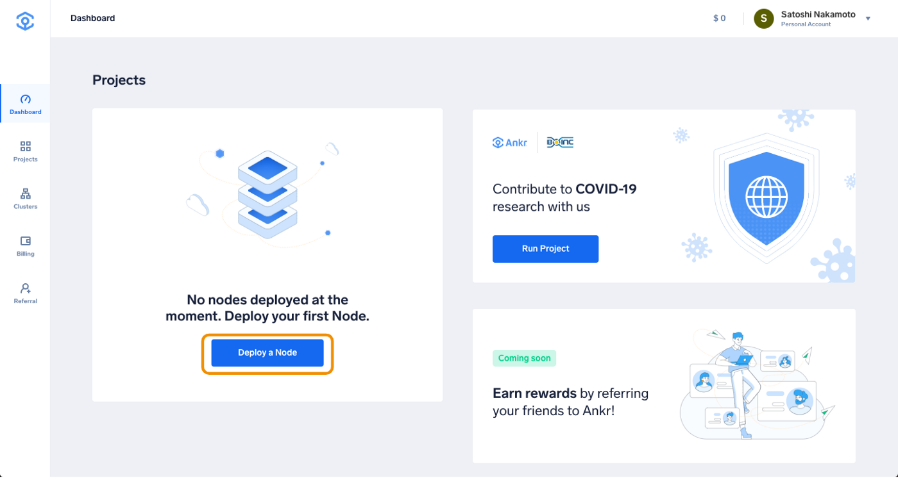
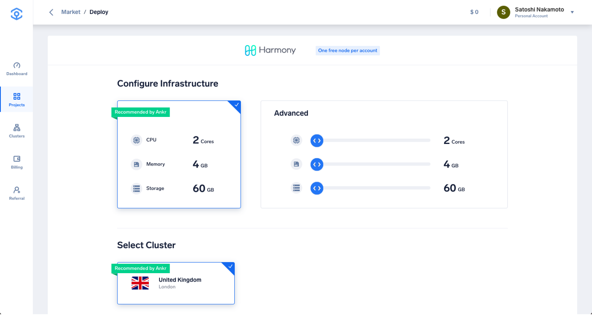
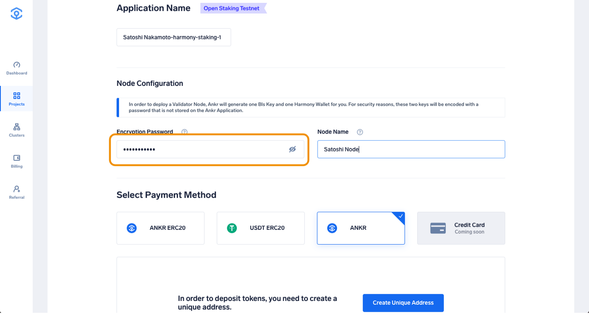
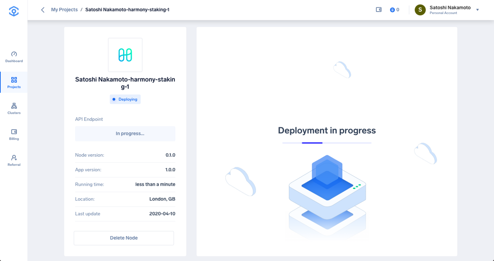
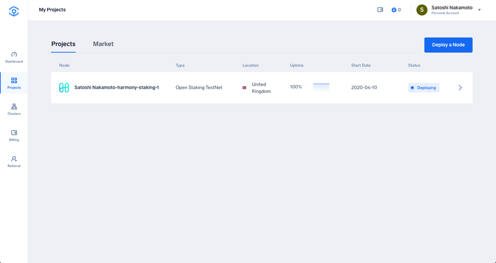
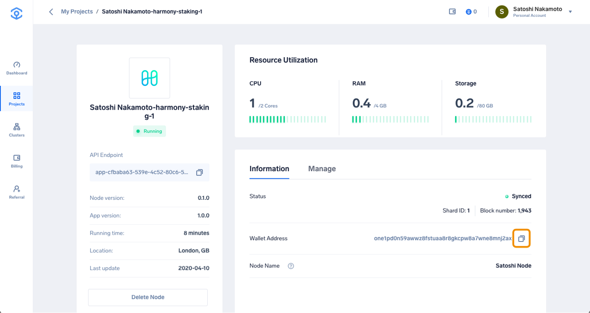
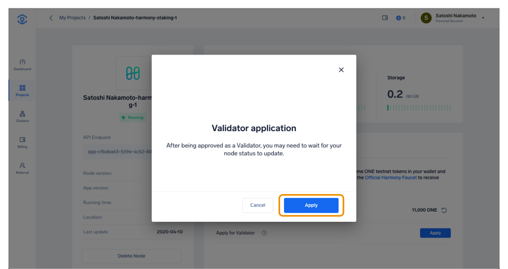
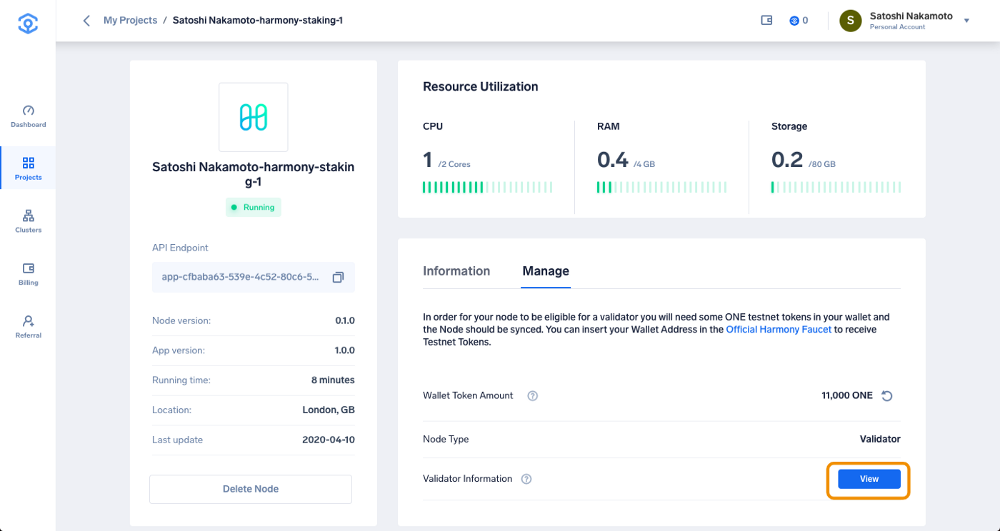

# Ankr

## Deploying a Harmony Node on Ankr 部署Ankr节点

注册一个Ankr账户。

网址：[https://app.ankr.com/](https://app.ankr.com/)

备注：您可以使用QQ邮箱、谷歌邮箱等进行注册。

注册成功并拥邮箱进行验证后，可进入首页，点击“Project”下方的“Deploy a Node”（部署一个节点

在接下来出现的众多页面中找到Harmony的公开抵押测试网，点击“Deploy”（部署）。

The hardware configuration is already set at the optimal system requirements. The platform also recommends a cluster, which is usually the one that has the most freely available resources. In this particular case, the recommended cluster is UK cluster, but another cluster may be recommended depending on your location.硬件配置已设置为最佳系统要求。 该平台还推荐了一个Cluster群集，该群集通常是拥有免费可用资源的群集。 在这种情况下，推荐的群集是UK群集，但是根据您所在的位置，可能会建议另一个群集。建议选择第三个位于美国的服务器，离初始节点更近，同步速度更快。

In order to deploy the Node, Ankr will generate a BLS Key and a Harmony Wallet for you. For security reasons, these two keys will be encoded with a password that must be set in the **Encryption Password** field. Please make sure to write this password somewhere safe in order to regain access to your keys. 为了部署节点，Ankr将为您生成一个BLS密钥和一个Harmony Wallet。 出于安全原因，这两个密钥将使用必须在“加密密码”字段中设置的密码进行编码。 请确保将此密码写在安全的地方，以便重新获得对密钥的访问权限。

Next, you need to insert a node name in order to identify and get realtime stats of the node on the [Harmony Validator Explorer](https://staking.harmony.one/validators), once your node is elected as a Validator.接下来，一旦您的节点被选中，则需要插入一个节点名称，以便在Harmony Validator Explorer上标识并获取该节点的实时统计信息。“Node Name”是在Dashboard上显示的节点名称，在这里不能用中文。

If you are using the application for the first time, you need to generate a deposit address by clicking Create Unique Address. When the address is generated, click **Deploy Node** to finish the Harmony Open Staking node deployment. 如果您是第一次使用Ankr，则需要通过单击创建唯一地址来生成一个存款地址。 生成地址后，单击“Deploy Node部署节点”以完成节点的部署。

## Node Status and Staking 节点状态和委托

Your Harmony node is deploying. Click on the Node to check the details. 您的Harmony节点正在部署。 单击节点以查看详细信息。服务器会自动对接Harmony网络，进行节点创建工作（右侧页面会显示“Deployment in progress”）。等待一段时间（一般为一到两分钟）后，如图所示，在下方“Information”栏，您可以看到您的节点状态（显示“Syncing”为正在同步测试网数据中，“Synced”为已同步），同步时间一般在十分钟左右不等，如果太长时间没有变化，刷新一下页面即可。

In order to be eligible for a Validator seat, you need to have ONE tokens in your wallet. You can transfer ONE tokens from any wallet to the generated ONE wallet address from the **Information** tab. 为了有资格获得验证者席位，您的钱包中必须有一定数量的代币。 您可以从“Information 信息”选项卡生成一个钱包地址并从其他钱包向这个地址转账。

Once the ONE tokens are visible in your token wallet, you can **Apply** for a Validator spot. 一旦在您的令牌钱包中看到ONE代币，就可以申请一个验证者点。点击“Apply”选项后，在弹出的窗口继续选择“Apply”，系统会自动开始进行应用，将钱包内的测试网代币，节点开始进行最终部署。

You can check your Validator Information on the Staking Dashboard by clicking the **View** Button. 您可以通过单击查看按钮在Staking Dashboard上查看您的Validator信息。

