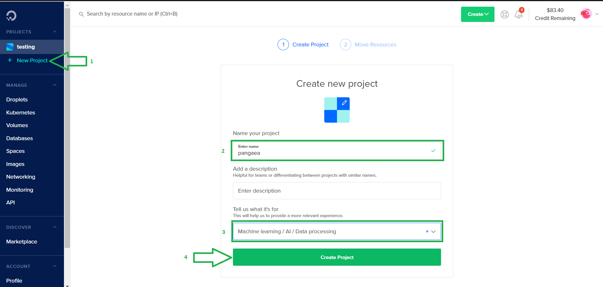
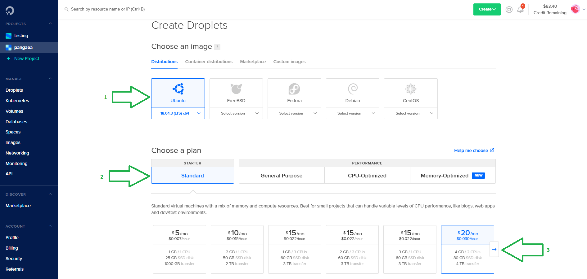
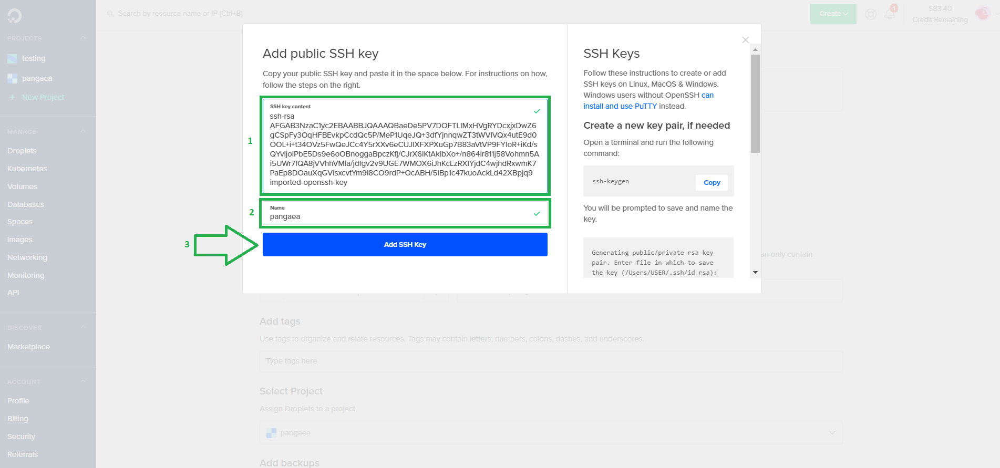
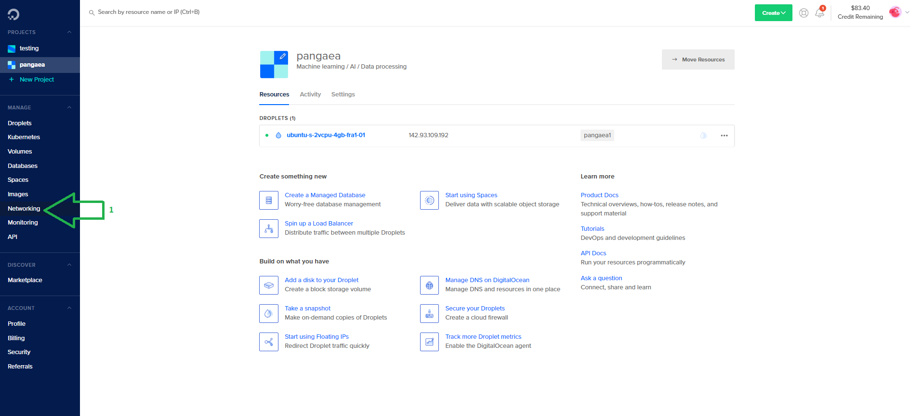
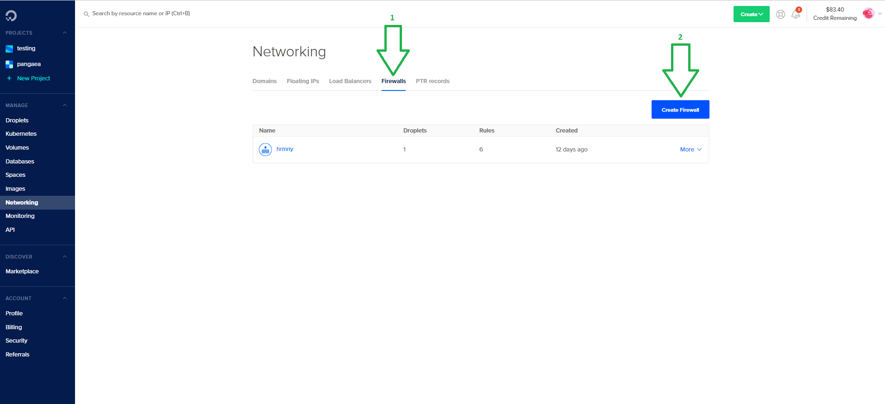
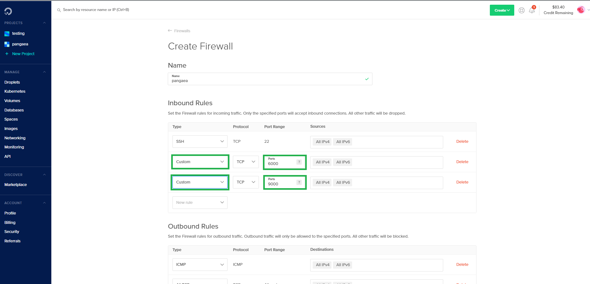

# Digital Ocean


For new users, you can get $100 dollars free credits to run Digital Ocean services for 2 months using the link bellow 通过下方的链接，新注册用户可以领取100美元的免费额度用于体验Digital Ocean的任何服务\(2个月有效期\)


## Step 1: Launching your Digital Ocean Node 步骤一：启动您的Digital Ocean节点 <a id="step-1-launching-your-aws-node"></a>

### Logging into **Digital Ocean 登录**Digital Ocean <a id="logging-into-vultr"></a>

[​](https://www.digitalocean.com/)Click [here](https://m.do.co/c/a2c4c02a60b2) to register a new Digital Ocean account or login if you have an existing one. 如果你还没有Digital Ocean的账户，可以点击这个[链接](https://m.do.co/c/a2c4c02a60b2)创建

### Create a new P**roject 创建一个新项目** <a id="create-a-new-instance"></a>

Once you have set up and logged into your Digital Ocean account, click on the top left bar “Projects -&gt; New Project". Enter the desired project name and click on "Create Project" as shown by the image bellow: 当你登录并进入Digital Ocean的控制台后，点击左侧菜单的“Projects -&gt; New Project"按钮，填入项目名称\(例如harmony\)后点击"Create Project"按钮，如下图所示：



### Create a new Droplet 创建一个新实例 <a id="create-a-new-instance"></a>

On the top right corner click on "Create"-&gt;"Droplets". 点击右上角的"Create"按钮，并在下拉选项中选择"Droplets"，如下图所示：


Choose now your desired Linux image. We recommend either the latest **LTS version of Ubuntu** \(18.04 as of date of now\) or the latest version of **Debian**. Use the left and right arrows to navigate between the different plans available. Choose the "Standard" plan and then select a virtual machine with at least 2 CPUs, 4GB of RAM and 80GB SSD. 选择你新创建实例的Linux系统发行版本，我们推荐选择 最新**LTS版本的Ubuntu \(**当前为18.04**\)** 或 最新版本的**Debian。**在下方的实例配置面板中选择"Standard"配置\(运行验证者节点至少需要2 CPUs，4GB内存 和 80GB硬盘空间\)。通过点击实例配置面板左右两侧的箭头图标可以看到更多的配置，如下图所示：



You can select the datacenter region of your choice here. We chose "Frankurt" in our example. We recommend using the "SSH Keys" as your authentication method \(more secure\) instead of the "One-time password" method. A button with the name "New SSH key" will appear on screen, just click on it. 接下来选择你期望部署实例的数据中心地域\(为保证节点网络的稳定，请勿选择中国国内的数据中心地域\)。我们推荐避免使用"One-time password"而是使用"SSH Keys"的方式来进行实例的鉴权\(这样会更加安全\)。你只需要点击出现在页面中的"New SSH key"按钮来创建SSH Keys。


To create your SSH key click [here](https://www.digitalocean.com/docs/droplets/how-to/add-ssh-keys/) for instructions. 或者你也点击这个[链接](https://www.digitalocean.com/docs/droplets/how-to/add-ssh-keys/)来了解如何自行创建SSH key

When you generated your public SSH key, give it a name and click on button "Add SSH key" as shown by the image bellow. In case you don't have a public SSH key yet, just follow the instructions to create it. 当你创建完SSH key后，粘贴公钥到对话框中，并为他取一个容易记忆的名称\(例如harmony\)，然后点击"Add SSH key"按钮。如下图所示。如果你还没有SSH key公钥，可以按照上面的步骤完成创建。



Choose a custom hostname if you want and then click on "Create Droplet". 填写一个容易记忆的实例的名称\(例如harmony\)，然后点击"Create Droplet"完成实例创建。

### Firewall Setup 防火墙配置 <a id="firewall-setup"></a>

Wait a few seconds till your droplet is created and then click on "Networking" on the left bar. 等待你的实例创建完成后\(进度条消失\)，点击左侧菜单的"Networking"



Click on "Firewall" and then on "Create Firewall". 切换到"Firewall"选项卡，再点击"Create Firewall"按钮。如下图所示。



In the Inbound Rules section, click on "New rule" and select "Custom". Leave the protocol as **TCP** and fill the port range field with **6000**. Repeat the same procedure for port **9000**. You will be left with 2 inbound rules as shown by the image bellow. 在"Inbound Rules"设置面板，点击"New rule"，选择"Custom"，选择Protocol类型为**TCP**填写Port Ranges为**6000。**重复上述动作，在下一行选择Protocol类型为**TCP**填写Port Ranges为**9000。**这样你就完成了两条入网防护规则的创建。如下图所示。



In the Outbound Rules section leave it as it is. Type the name of the droplet you want to apply your firewall rules \(the droplet name is the same as your hostname you chose previously\).Click now on "Create Firewall". 在"Outbound Rules"设置面板保持默认配置不做改动，并在下方选择你刚才创建的实例名称\(任意输入名称包含的字母即可出现选项\)。最后点击"Create Firewall"按钮完成防火墙的创建。


## **Step 2: Connecting via SSH to your Instance 步骤二：通过SSH登录你的实例** <a id="step-2-connecting-to-your-vultr-node"></a>

To connect via SSH to your Digital Ocean instance, please follow the instructions [here](https://www.digitalocean.com/docs/droplets/how-to/connect-with-ssh/). 期望通过SSH登录你的Digital Ocean实例，请点击[链接](https://www.digitalocean.com/docs/droplets/how-to/connect-with-ssh/)了解详细步骤。

## Step 3: Installing Required Packages 步骤三：安装部署依赖的软件包

Before anything, it is recommended to update your system: 在此之前，我们推荐在你的实例中先执行下列命令来更新安装器：

```bash
sudo apt update && apt upgrade
```

Now install the following packages that will be needed to run Harmony by typing: 接下来通过执行下列命令来安装运行节点所依赖的软件包：

```bash
sudo apt install dnsutils && sudo apt install tmux
```

You will be asked to confirm if you would like to download and install these packages. Just press Y to confirm. 当你下载安装上述软件包的时候会被安装器询问是否同意安装，请输入 Y 字母进行确认。

