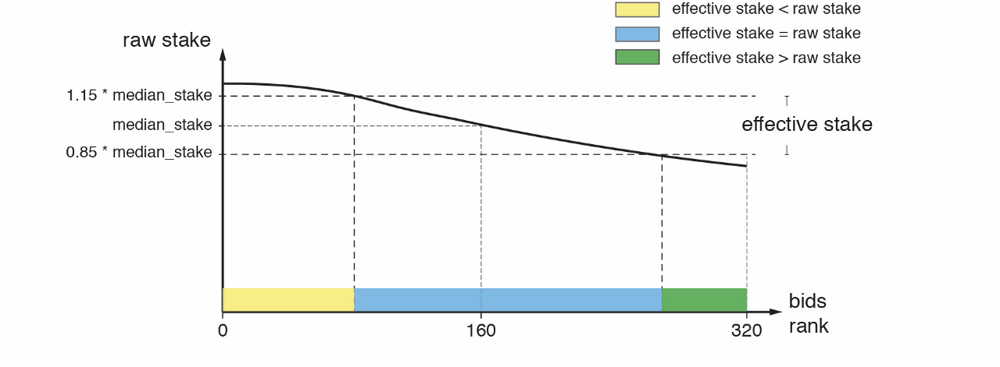

# Effective Proof-of-Stake 有效质押

Effective stake is a new measure introduced in EPoS in order to prevent stake centralization and still provide capitalistic fairness. For exactly how it achieves that, [here](https://medium.com/harmony-one/introducing-harmonys-effective-proof-of-stake-epos-2d39b4b8d58) is the design rationale behind it.

Let’s call the bid price of the elected BLS keys the _raw stake_. The effective stake of an elected BLS key is a bounded value on its raw stake with a threshold around the median bidder’s raw stake \(denoted as median\_stake in the picture below\). The upper threshold is 115% of the median\_stake and the lower threshold is 85% of the median\_stake. For a key with raw stake that’s out of bound of the threshold, its effective stake will be bounded by the corresponding threshold, otherwise, the effective stake is the same as the raw stake.

The effective stake of each BLS key is determined at the last block of an epoch during the election process and will stay the same throughout the next epoch.

有效质押是EPoS机制中引入的一项新概念，目的是防止权益集中化同时，提供资本公平性。 对于它是如何实现的，以下是其背后的设计原理。

我们称选举的BLS私钥的出价为_原始抵押_。当选的BLS私钥的有效抵押是其原始抵押的一个有限值，其阈值围绕中值竞标者的原始抵押（在下图中表示为mean\_stake）。高阈值是中位数的115％，低阈值是中位数的85％。对于原始抵押超出阈值的BLS私钥，其有效权益将受相应阈值的限制，否则，有效权益与原始权益相同。

每个BLS私钥的有效抵押是在选举过程的最后一个epoch确定的，并将在下一个epoch保持不变。

