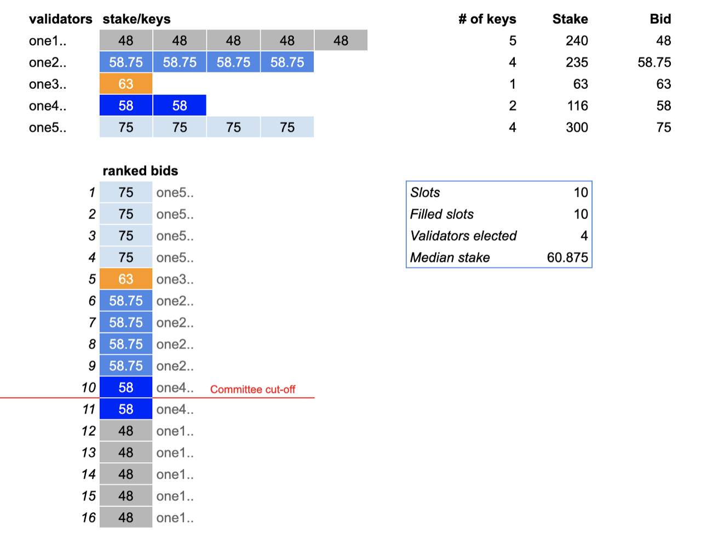

# Slots Bidding and Election席位竞标与选拔

In Open Staking of mainnet, there will be 320 slots available for bidding. A slot represents membership in the network which gives the validator the right to use a specific BLS key to sign on blocks and the signature will be acknowledged by other validators.

After you create the validator record, the tokens you stake, along with any delegated tokens to your validator, will be automatically used to bid for the slots.

Each of the added BLS keys will create a unique bid for a slot in the network. The bid price equals the total stake on your validator divided by the total number of BLS keys attached to your validator.

Simply put, all tokens staked to the validator will be equally divided into each BLS key and each key bids separately. For example, a validator with a total stake of 300 ONE and 3 associated BLS keys will have 3 bids each with a bid price of 100 ONE.

The election for the slots works as follows.

1. Before the start of an epoch, all validator bids are ranked by bid price in descending order.
2. The highest 320 bids will be awarded the slots in the upcoming epoch.

The BLS key that successfully bids for a slot is deemed **elected**. Elected BLS keys will eventually form the committees of the shards. A validator in possession of at least one elected BLS key is also deemed **elected.**

在主网的公开抵押中，将有320个席位可供竞标（包含Stake Heist中的200个席位）。 一个席位代表网络中的委员会一个成员资格，它让验证者能够使用特定BLS私钥在区块上签名，且该签名将稍后被其他验证者知晓。

创建验证者记录后，您抵押的代币以及委托者抵押给您的代币，都将自动用于竞标席位。

每个添加的BLS私钥都会在网络中出一个竞价。这个竞价就等于验证者的总本金除以验证者附带的BLS私钥的数量。

简而言之，验证者所有币将被平摊到每个BLS私钥上，每个BLS私钥单独出价。 例如，一个验证者有300个ONE，同关联了3个BLS私钥，那么它会出3个标，每个标出价为100 ONE。

席位的选择方式如下。

1. 开始一个epoch之前，所有的验证者都按照竞价从大到小排列。
2. 排名前320名获得获得即将开始的epoch的320个位置。

成功竞标席位的BLS私钥表示**当选**。当选的BLS私钥最终将构成分片委员会。 因此，拥有一个竞选成功的BLS密钥的验证者也被视为**竞标成功**。

Above is a simple example of bidding and election process with 10 slots and 5 validators.

