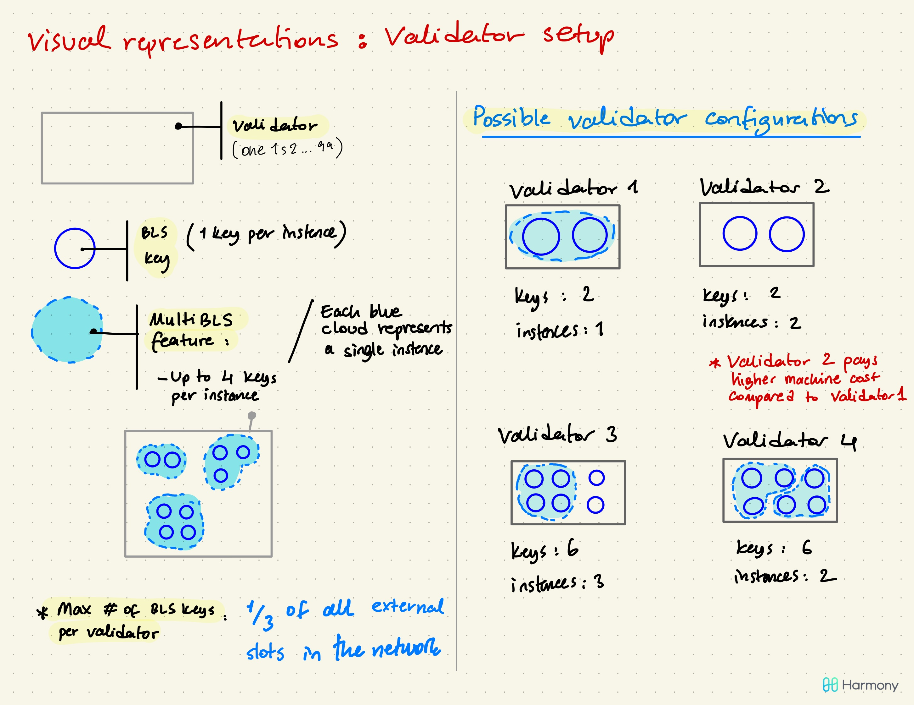
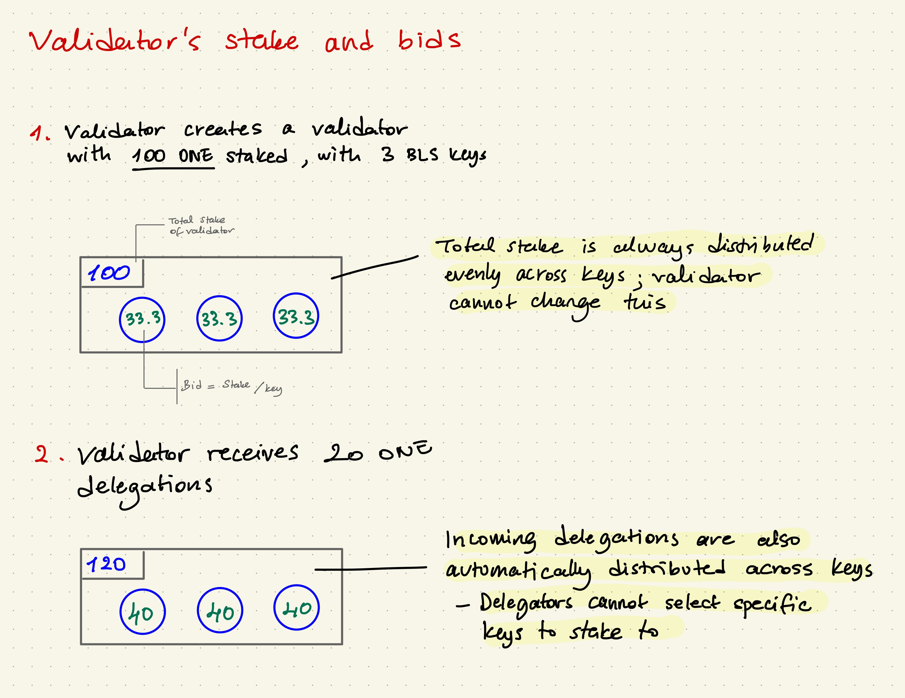

# Validator, BLS key, Instance 验证者，BLS钥匙，机器

## Validator Setup and Configuration

A validator in Harmony blockchain is a single person or entity who stakes tokens and runs nodes \(validator client software\) to validate blocks. A validator can specify one or multiple validating keys \(a.k.a. [BLS](https://en.wikipedia.org/wiki/Boneh%E2%80%93Lynn%E2%80%93Shacham) keys\) which will be used to sign on validated blocks.

To become a validator in Harmony, you will need to do the following:

1. Setup a validator node\(s\) and let it fully synchronized with the latest blockchain. 
2. Create an on-chain validator record by sending a **CreateValidator** \__\*\*_\_transaction. 
3. Start validating using the node\(s\) with the BLS key\(s\) you added in your validator record

There are many fields to configure for your validator. It’s worth clarifying some of the important fields in more detail:

1. **amount:** The amount of ONE tokens the validator will stake initially.
2. **rate:** The commission fee \(%\) the validator charges from the block reward. 
3. **bls-pubkeys:** One or multiple BLS public keys the validator will sign with. Each BLS key will be used separately to bid for a slot and if successful, the key is obligated to validate blocks. 

### **验证者设置和配置** 

Harmony区块链中的验证者可以是个人或公司，他们通过抵押代币并运行节点（验证者客户端软件）来验证区块。 验证者可以创建一个或多个验证私钥（也称为[BLS](https://en.wikipedia.org/wiki/Boneh%E2%80%93Lynn%E2%80%93Shacham)私钥），这些私钥将用于在已验证的区块上签名。

要成为Harmony的验证者，您需要执行以下操作：

1. 设置一个验证者节点，并使其与最新的区块链网络完全同步。 请按照[**此处**](https://docs.harmony.one/home/validators/first-time-setup)运行节点。
2. 通过发送一个“**创建节点**”交易，创建一个链上的节点记录， 请按照[**此处**](https://docs.harmony.one/home/validators/first-time-setup/creating-a-validator)创建验证者。
3. 您在验证者记录中会添加一个BLS私钥，用这个私钥关联的节点开始验证。

在验证者配置过程中有许多术语，在这里我们为大家再详细地解释一下：

1. **数量：**验证者最初将抵押的ONE代币的数量。
2. **费率：**验证者从奖励中收取的佣金（％）。（请参阅章节：区块奖励）
3. **bls-pubkeys：**验证者将使用其签名的一个或多个BLS公钥。 每个BLS公钥将单独用于竞标一个席位，如果成功，则该公钥必须用于验证区块。 （请参见“席位竞标与选择”章节）

有关如何配置验证者的详细指南，请参照[**此处**](https://docs.harmony.one/home/validators/managing-your-validator/changing-validator-information)。

## BLS key\(s\) 


[BLS](https://en.wikipedia.org/wiki/Boneh%E2%80%93Lynn%E2%80%93Shacham) stands for **Boneh–Lynn–Shacham**. It is a digital signature method used for verifying the authenticity of digital messages or documents. BLS （Boneh-Lynn-Shacham）签名算法是一种可以实现签名聚合和密钥聚合的算法，它可以把一笔交易中的所有签名和公钥合并成单个签名和公钥，且合并过程不可见（无从追溯这个签名或公钥是否通过合并而来）。


A BLS key represents what the validator signs the blocks with, and is a way of authenticating the validator. A validator can have multiple keys to sign with, this means that a validator is signing blocks in parallel.

BLS keys are attached to validator via:

* Creating a new validator \(put commas between multiple BLS keys\)
* Adding new keys to an existing validator \(edit-validator --add-bls-key\), only one key can be added at a time

## Instance\(s\) & Multi-BLS keys

An instance is a virtual private server or dedicated hardware with a unique IP address on which a validator runs the node software.

Within each instance, there could be up to 4 BLS keys signing transactions. If you have more than a single BLS key in your instance, it means that you're using the **multiBLS feature**. If you have a single BLS key in the instance, we will call that single-key instance.

Here are **some rules to follow:**

* In order to use multiBLS feature \(multiple BLS keys in same instance\), all keys are required to be on the **same shard**
* Total number of BLS keys allowed per validator is **1/3 of total external seats** \(network level\)

Note that validators sometimes choose to run duplicate instances \(2 instances, each running with same BLS key\) as a backup mechanism.

Below are some differences to using multiBLS vs. single-key instance:

* Machine cost will be lower in a multiBLS instance \(compare 'validator 2' vs. 'validator 1'\)
* Single-key instances could run nodes for a validator in different shards, whereas a multiBLS instance requires all BLS keys to be in the same shard
* MultiBLS and single-key instance have different staking commands
* In order to make changes to the keys in a multiBLS instance, the node needs to be stopped and restarted; whereas a single-key instance can be directly added to a validator \(since the node is running on a different instance\)
* Too many BLS keys signing using a single node creates a single point of failure \(validator’s risk\)

## Visualization

