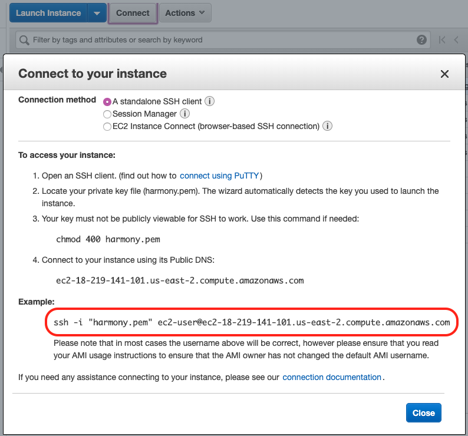

# Setup Cheatsheet指令备忘录

If you are new to setting up Validators, start [here](validator-cheat-sheet.md).

1. Access your cloud instance. 接入你的云服务。

```bash
ssh -i [KEY].pem [SSH ADDRESS]
```



1. Install `tmux`, if your Linux distribution does not come with it. 安装tmu新

```bash
sudo yum install tmux
```

1. Download the Harmony CLI.

```bash
curl -LO https://harmony.one/hmycli && mv hmycli hmy && chmod +x hmy
```

1. Create a BLS Key.

```text
./hmy keys generate-bls-key --passphrase
```

1. Download `node.sh`.

```bash
curl -LO https://raw.githubusercontent.com/harmony-one/harmony/master/scripts/node.sh \
&& chmod a+x node.sh
```

1. Start a new `tmux` session called `node`.

```bash
tmux new-session -s node
```

1. Run the node.



```bash
./node.sh -S -c -z -I -N staking -k [BLS KEY FILE].key
```



1. Detach from the tmux session by pressing CTRL and B at the same time, then press D.
2. Check that your node is syncing \(block height &gt; 0\).

```bash
./hmy blockchain latest-header
```

1. Create a new wallet.

```bash
./hmy keys add [ACCOUNT NAME] --passphrase
```

1. Get tokens for your validator



```bash
curl -X GET https://faucet.os.hmny.io/fund?address=[ONE ADDRESS]
```



1. Create your Validator



```bash
./hmy --node="https://api.s0.os.hmny.io" staking create-validator \
    --validator-addr [ONE ADDRESS] --amount 100000 \
    --bls-pubkeys [BLS PUBLIC KEY1],[BLS PUBLIC KEY2] \
    --name JohnWhitton --identity JohnIdentity --details "John The Validator" \
    --security-contact John --website john@harmony.one \
    --max-change-rate 0.1 --max-rate 0.1 --rate 0.1 \
    --max-total-delegation 100000000 --min-self-delegation 100000 --passphrase
```



1. Check that your ONE address exists as a validator



```bash
./hmy --node="https://api.s0.os.hmny.io" blockchain validator all | grep [ONE ADDRESS]
```



1. Collect rewards.



```bash
./hmy --node="https://api.s0.os.hmny.io" staking collect-rewards --delegator-addr [ONE ADDRESS] --passphrase
```



1. Check validator information for active flag / availability \(block signed\) / etc ...



```bash
./hmy --node="https://api.s0.os.hmny.io" blockchain validator information [VALIDATOR ONE ADDRESS]
```



