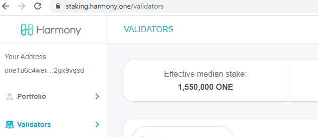

# Why am I not elected in the EPOS Committee 为什么我的节点没有被选中 \(待更新）

## EPOS medium document EPOS简介

[https://harmony.one/epos](https://harmony.one/epos)

## **Now let’s get into action.让我们来开始吧**

Non election in the EPOS committee are caused by two main issues 你的节点没有被选中主要是有两个原因造成的:

1. Your validator profile needs to have satisfactory conditions 
   1. stake has to be among the 320 highest stake before the change of next epoch
   2. Active flag needs to be true
   3. The numbers of block signed per epoch needs to be above 66%
2. Your node needs to be functional

   1. Fully synced
   2. Signing blocks

1。你的验证者节点必须满足一下条件：

1. 单个钥匙的质押量必须在下一个epoch之前排名前320个
2. 活动标志必须为真 
3. 每个epoch的签名百分比必须高于66％

2。 您的节点必须正常运行:

1. 完全同步
2. 在签名

## **Validator profile need to satisfy the below**

### Bidding for a place in the EPOS committee 在EPOS委员会中竞标

#### Verify the median stake验证中位数



```bash
 ./hmy --node="https://api.s0.t.hmny.io" blockchain median-stake | grep median
    "epos-median-stake": "1550000000000000000000000.000000000000000000",
```



go to : [https://staking.harmony.one/validators](https://staking.harmony.one/validators)






the CLI returned a value in wei, it can be converted online converter like [https://eth-converter.com/](https://eth-converter.com/) CLI在wei中返回了一个值，可以将其转换为在线转换器，例如[https://eth-converter.com/](https://eth-converter.com/)


#### Total delegation is above the median stake 总质押高于中位数

Visit [https://staking.harmony.one/validators/](https://staking.harmony.one/validators/)&lt;youroneaccount&gt;

Example : [https://staking.harmony.one/validators/one1u6c4wer2dkm767hmjeehnwu6tqqur62gx9vqsd](https://staking.harmony.one/validators/one1u6c4wer2dkm767hmjeehnwu6tqqur62gx9vqsd)


Your current total stake has to be among the 320 \(in P3 or mainnet, 200 for OSTN\) highest stake before the change of next epoch. For that, one way to make sure of it is to be near / above the median stake.

Being just above the last bidder would ensure your a place but it is risky as you might be outbid during the next election.

If you are not above the median stake then time to ask for more delegation or delegate yourself more ONE token following this doc on [how to delegate more ONE token](https://docs.harmony.one/validators/validator/managing-your-validator/delegating-to-a-validator)

在更改下一个epoch之前，您当前的总质押必须排名在320名最高赌注中。为此，确保这一点的一种方法是接近/高于中位数。 刚好高于最后一位竞标者可以确保您获得席位，但是这样做很冒险。 如果您还没有超过中位数赌注，那么该文档之后将有时间要求更多的委托或给自己委托更多的ONE令牌，有关如何委托更多的ONE令牌 确


Make sure your max-total-delegation is high enough and above the median stake so your added delegation work 确保您的最大委托总额足够高并且高于中位数


#### **Your validator node** epos-eligibility-status **flag needs to be active** 您的验证者节点epos-eligibility-status标志需要处于活动状态

Issue the command 发出命令  
./hmy -n [https://api.s0.os.hmny.io](https://api.s0.os.hmny.io) blockchain validator information \[VALIDATOR-ACCOUNT\] \| grep epos-status

```bash
./hmy --node="https://api.s0.t.hmny.io" blockchain validator information  one1u6c4wer2dkm767hmjeehnwu6tqqur62gx9vqsd | grep epos-status
    "epos-status": "currently elected",
```

If **not eligible**, update it to active via the command 如果不符合要求，请通过以下命令将其更新为活动状态  
./hmy -n [https://api.s0.os.hmny.io](https://api.s0.os.hmny.io) staking edit-validator --validator-addr &lt;ONE\_VALIDATOR\_ACCOUNT&gt; --active true --passphrase

```bash
./hmy --node="https://api.s0.t.hmny.io" staking edit-validator --validator-addr one1u6c4wer2dkm767hmjeehnwu6tqqur62gx9vqsd --active true --passphrase
```

**Finally check your signed blocked** 最后检查您的签名 

using the command  
./hmy -n [https://api.s0.os.hmny.io](https://api.s0.os.hmny.io) blockchain validator information &lt;ONE\_VALIDATOR\_ACCOUNT&gt;

```bash
./hmy --node="https://api.s0.t.hmny.io" blockchain validator information one1u6c4wer2dkm767hmjeehnwu6tqqur62gx9vqsd
```

and search for:

```bash
    "current-epoch-performance": {
      "current-epoch-signing-percent": {
        "current-epoch-signed": 50,
        "current-epoch-signing-percentage": "0.500000000000000000",
        "current-epoch-to-sign": 100,
        "num-beacon-blocks-until-next-epoch": 28
      }
    },
```

For your validator to stay elected, you wanna make sure the current-epoch-signing-percentage is above 66% \(0.66\). 为了使您的验证者能够继续当选，您需要确保当前epoch签名率高于66％（0.66）。 

To fix the above, we have to make sure the node is working correctly and below are few pointers 要解决以上问题，我们必须确保节点正常工作，下面是一些参考

### Your node needs to be functional 您的节点必须正常运行

#### Fully synced node 完全同步的节点

Compare your block height 比较你的区块高度

```bash
 ./hmy blockchain latest-headers | grep block-number
```


If the above doesn’t work and you have an error message similar to this: _commit: v304-0e26945, error: dial tcp4 127.0.0.1:9500: connect: connection refused_  
It means the harmony node binary is not running. Please follow this documentation on [how to run the node](https://docs.harmony.one/validators/validator/first-time-setup/download-node-script).

如果以上操作均无效，并且您收到以下错误消息：提交：v304-0e26945，错误：拨打tcp4 127.0.0.1:9500：connect：连接被拒绝 这意味着和谐节点二进制文件未运行。请遵循此文档以了解如何运行节点。


and the network block height 和网络块高度进行对比

```bash
./hmy --node="https://api.s0.t.hmny.io" blockchain latest-headers | grep blockNumber
```

Make sure network height and your current height are very close or equal. Also, for non shard 0 node, you need 2 DBs to be synced, your non-shard 0 and the shard 0. 确保网络高度与您当前的区块高度非常接近或相等。此外，对于非分片0节点，您需要同步2个DB，即分片0和你节点所在的分片。


the above command is for network height on shard 0, change s0 to s1, s2, .. to match yours in the api URL 上面的命令用于分片0上的网络高度，将s0更改为s1，s2，..以在api URL中匹配您的分片


When you are fully synced and your validator profile is satisfactory you should start having BINGOs in your validator log file at **epoch change**. 当您完全同步并且验证者的设置完成，应在epoch更改时你的log里应该已经开始产生BINGO

You can check BINGOs via this command 您可以通过此命令检查BINGO

```bash
tail -f latest/zero*.log | grep BINGO
```

And you’ll notice in your validator information that you started signing blocks 你的验证者应该已经开始对区块进行签名

```bash
    "current-epoch-performance": {
      "current-epoch-signing-percent": {
        "current-epoch-signed": 60,
        "current-epoch-signing-percentage": "1.000000000000000000",
        "current-epoch-to-sign": 60,
        "num-beacon-blocks-until-next-epoch": 28
      }
    },
```

**If you fail** to sign blocks, verify your machine/vps doesn't have CPU/memory/hard disk/internet issues. When you fail to sign more than 66% of the blocks in an epoch, you’ll be kicked out from the committee 如果您无法签署块，请确认您的机器/ vps没有CPU /内存/硬盘/互联网问题。如果您在某个时期内未签署超过66％的区块，您将被踢出委员会

