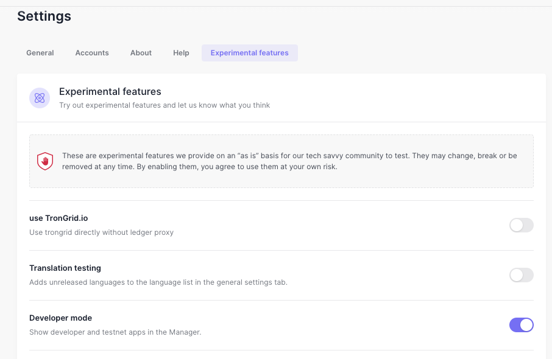
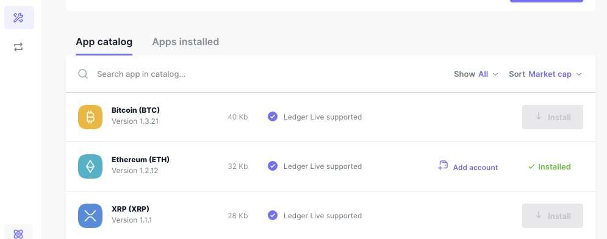
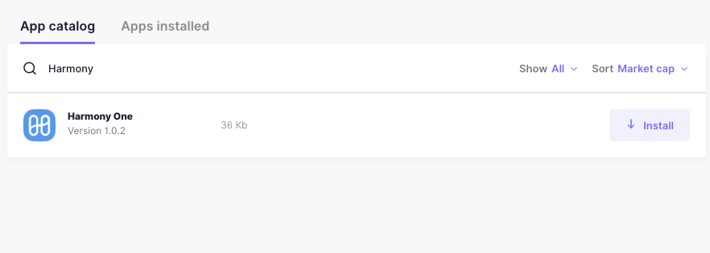
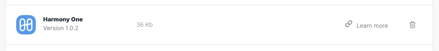

# Download & Setup


Currently Harmony is available only on Ledger Nano S.

目前Harmony仅仅支持Ledger Nano S。


## **Step 1. Turn on Developer开发者模式**

Download and install the latest Ledger Live version onto your computer. Ledger Live is the app you use to manage your Ledger device. Please follow the official installation instruction [here](https://support.ledger.com/hc/en-us/articles/360006395553). 将最新的Ledger Live版本下载并安装到计算机上。 Ledger Live是用于管理Ledger设备的应用程序。请按照此处的官方安装说明进行操作。 


Make sure to i[nstall the latest firmware](https://support.ledgerwallet.com/hc/en-us/articles/360002731113) on your device. This ensures compatibility with the Harmony app. 确保在设备上安装最新的固件。这样可以确保与Harmony应用程序兼容。 


Open Ledger Live, select Manager. Turn on **Developer Mode** in Manager: Settings -&gt; Experimental Features -&gt; Developer Mode, as shown below:  打开Ledger Live，选择“Manager”。在管理器中打开Developer Mode：设置-&gt;实验功能-&gt;开发人员模式，如下所示：

## **Step 2. Search for the App in the Catalog**步骤2.在目录中搜索应用 

Ledger live provides app catalog for different types of apps, as shown below:

Ledger live为不同类型的应用程序提供了应用程序目录，如下所示：

To find the Harmony app, type **harmony** in the search bar, as shown below:

要找到Harmony应用程序，请在搜索栏中输入Harmony，如下所示：

## **Step 3. Install/Remove the App**步骤3.安装/删除应用程序 

There are two buttons associated with Harmony One app. The **install** button can be clicked to install Harmony One app to Ledger Nano. The app can be uninstalled by clicking the trash bin button.

有两个与Harmony One应用程序关联的按钮。可以单击安装按钮将Harmony One应用安装到Ledger Nano。您可以通过单击垃圾桶按钮来卸载该应用程序。

## **Step 4. Using the App**步骤4.使用应用程序 

To use Harmony One app, please check your Ledger Nano device and click the buttons to open the app.

要使用Harmony One应用程序，请检查您的Ledger Nano设备，然后单击按钮以打开该应用程序。

