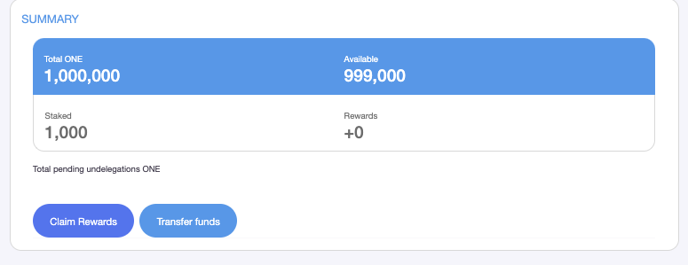
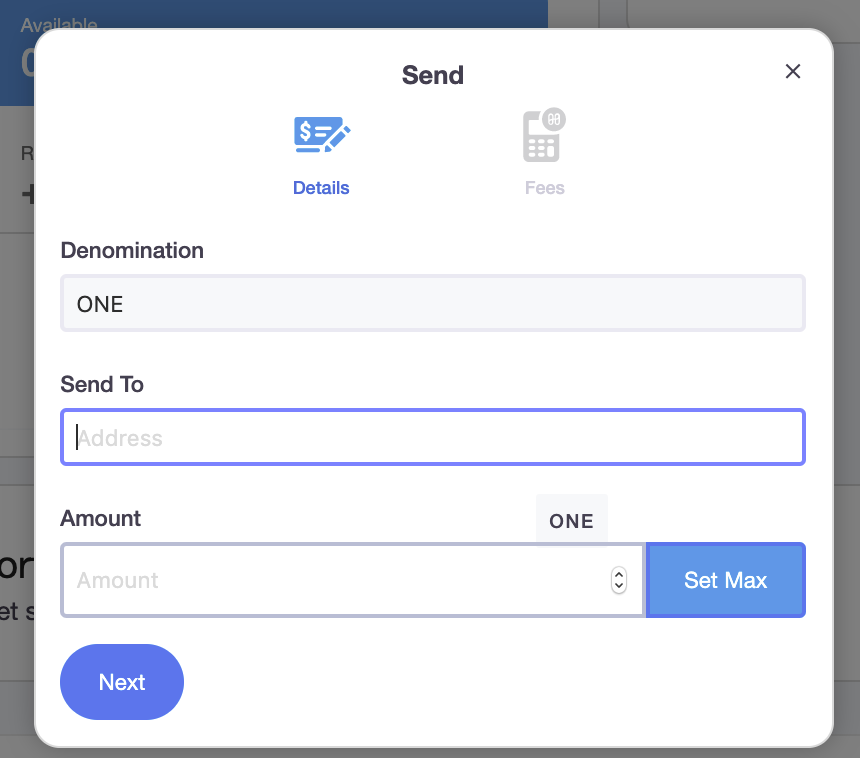
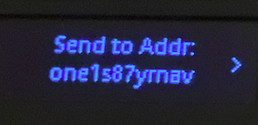
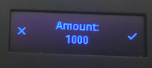
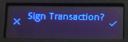
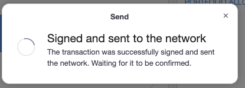
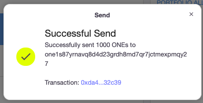

# Sending transactions via Ledger使用Ledger转账


Note: staking dashboard only process transactions on shard 0.

Staking Dashboard 目前仅支持Shard0 上的交易。


To send ONE tokens to an address, click the **"**Transfer funds" button and the send window will pop-up. 要进行转账，请单击“Transfer funds转账资金”按钮，发送窗口会自动弹出。

Input the amount of tokens to send and the destination address, then click the "next" buttons. 输入要转账金额和目标地址，然后单击“Next下一步”按钮。

Click the "Confirm and Sign" button to sign the transaction.单击“确认并签名”按钮以签署交易。

Check your ledger Nano S, the LED display on Nano S is shown as below. Click on the right button to review transaction on Ledger.检查分类帐Nano S，Nano S上的LED显示屏如下所示。 单击右侧按钮以查看Ledger上的交易。

Check and confirm the destination address is correct.检查并确认目标地址正确。

Check and confirm the amount is correct.检查并确认金额正确。

Currently, staking dashboard only supports transaction on shard0.当前，Staking Dashboard仅支持shard0上的交易。

Click the right button to start signing the transaction:

单击右键开始签署交易：

Once transaction is signed, Delegate window will pop-up on the staking dashboard and display the transaction status.交易签名后，Send窗口将在staking dashboard上自动弹出并显示交易状态。

It will display "Successful Send" once the transactions completes. 交易完成后，它将显示“成功发送”。

