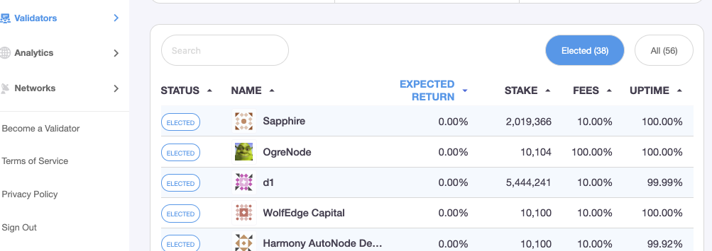
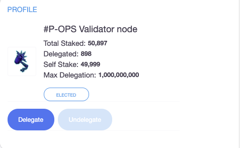
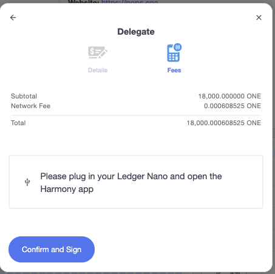
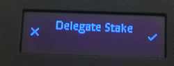
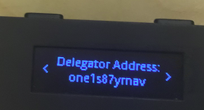
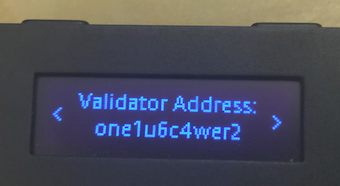
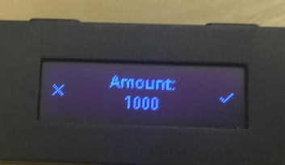
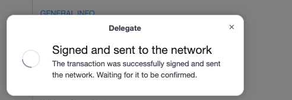

# Staking Transactions via Ledger使用Ledger质押

Check the validators page to see list of validators. Click on desired validator logo to check validator details. 在Validator页面上检查验证者的信息。 单击验证者徽标以检查验证者详细信息。

Click on the "Delegate" button to delegate to this validator.单击“Delegate质押”按钮进行委托。

Enter the desired delegation amount or scroll the percentage slider in the pop-up Delegate window. Delegation must be at least 1000 ONE. Click on "Next" and confirm the signature request. 输入质押金额，或在弹出的“Delegate委托”窗口中滚动百分比滑块。质押金额至少为1000 ONE。单击“下一步”并确认签名请求

Check your Ledger, it will display "Delegate Stake" in the LED screen. Press the right button to start signing the transaction.检查Ledger，它将在LED屏幕上显示“委托Delegate Stake”。按右按钮开始签署交易。

Check the delegator address. Press the right button to show full address. If correct, press both left/right buttons to continue. 检查委托人地址。按右按钮显示完整地址。如果正确，请同时按左右两个按钮继续。

Check the validator address. If correct, press both left/right buttons to continue.检查验证者地址。如果正确，请同时按左右两个按钮继续。

Check the delegation amount. If correct, press the right button to continue:

检查质押金额。如果正确，请按向右按钮继续：

Press right button to sign Delegate Stake confirmation.按右按钮签署代表确认签名。

The entire process is shown below整个过程如下所示：



Once transaction is signed, Delegate window will pop-up on the staking dashboard and display the transaction status. 交易签名后，Staking Dashboard将自动弹出“委托”窗口并显示交易状态。:

