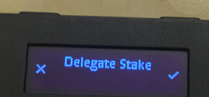

# Staking Transactions via Ledger

Harmony Staking Dashboard \([staking.harmony.one](https://staking.harmony.one/validators)\) also supports staking transactions.

Check the validators page to see list of validators. Click on desired validator logo to check validator details.

Click on the "Delegate" button to delegate to this validator.

Enter the desired delegation amount or scroll the percentage slider in the pop-up Delegate window. Delegation must be at least 1000 ONE. Click on "Next" and confirm the signature request.

Check your Ledger, it will display "Delegate Stake" in the LED screen. Press the right button to start signing the transaction.

Check the delegator address. Press the right button to show full address. If correct, press both left/right buttons to continue.

Check the validator address. If correct, press both left/right buttons to continue.

Check the delegation amount. If correct, press the right button to continue:

Press right button to sign Delegate Stake confirmation.

The entire process is shown below:



Once transaction is signed, Delegate window will pop-up on the staking dashboard and display the transaction status.

