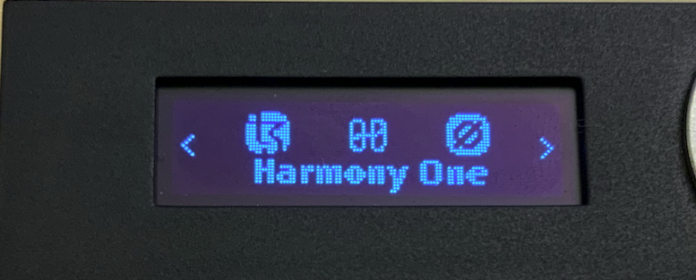
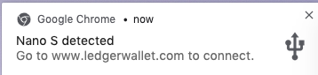
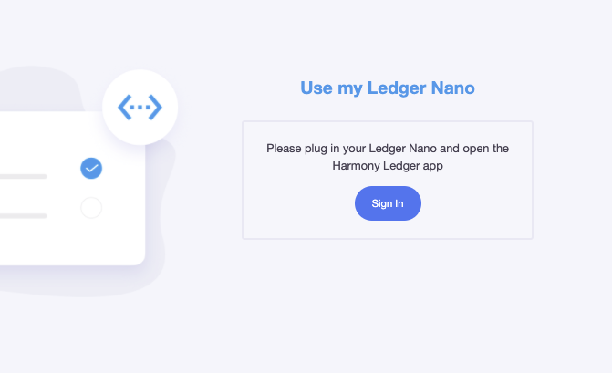
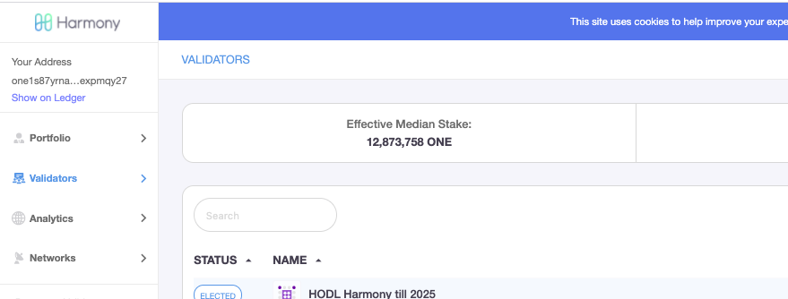
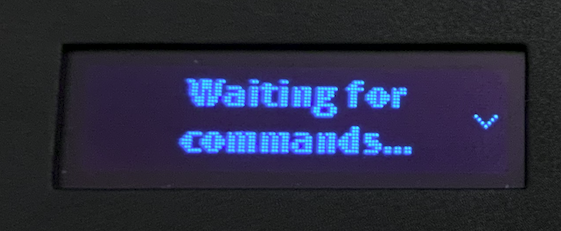
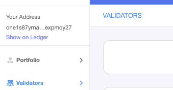
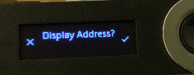
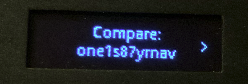

# Sign In With Ledger

Plug in your Ledger and open the Harmony Ledger App. Your device will be detected by your computer.

Start from the staking dashboard: [https://staking.harmony.one/ledger](https://staking.harmony.one/ledger) and click the "sign-in" button.

You will be directed to the Validators page on the Staking Dashboard and a small trident logo will appear on the chrome tab. Your Ledger Nano will display "waiting for commands" before you click on any buttons.

Click the "Show on Ledger" button to display your address on your Ledger device.

Click the right button on Ledger to continue and confirm the address is correct.

