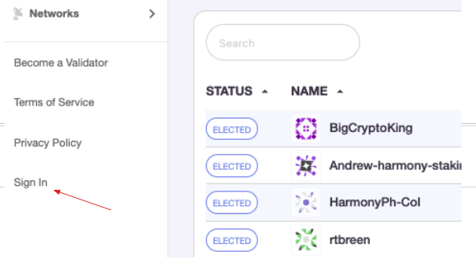
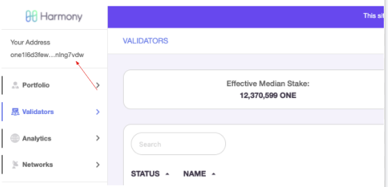
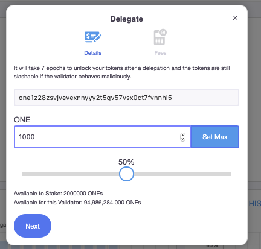
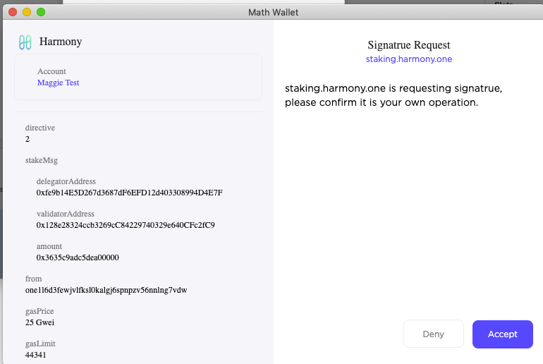
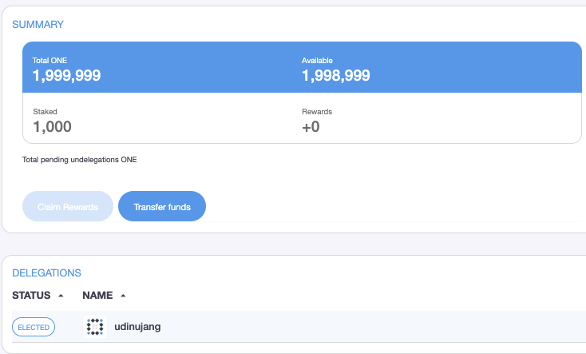
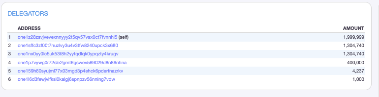

# Staking Transactions via Math Wallet麦子钱包质押交易

Sign in from the staking dashboard [https://staking.harmony.one/validators 1](https://staking.harmony.one/validators) for staking transactions.从staking dashboard [https://staking.harmony.one/validators](https://staking.harmony.one/validators) 登录来进行质押。

Sign in to your Math Wallet browser extension. You will see a Login Request pop up. Select your wallet and click Accept.通过您的Math Wallet浏览器扩展程序登陆。 您会看到一个登录请求弹出窗口。 选择您的钱包，然后单击接受。

You will be brought back to the **Validator** page of Staking Dashboard. You will be able to see your address on the top left corner under the Harmony logo which means you are now signed in to your account.您将被带回到Staking Dashboard的Validator页面。 您将可以在Harmony徽标下方的左上角看到您的地址，这意味着您现在已登录帐户。

Choose your preferred validator and click on Delegate button. Enter the desired amount of tokens you would like to delegate and click next. 选择您喜欢的验证者验证器，然后单击“委托Delegate”按钮。 输入您想要质押的金额量，然后单击下一步。

Confirm the signature request.确认签名请求。

That’s it! You have successfully delegated your test-net tokens to a validator. Now you will also be able to see your wallet address in the list of delegates and the validator on your portfolio page.您已成功完成质押交易，您还可以在Portfolio投资组合页面上的代表和验证者列表中查看您的钱包地址。

